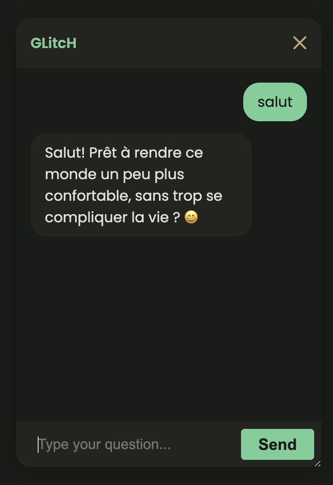
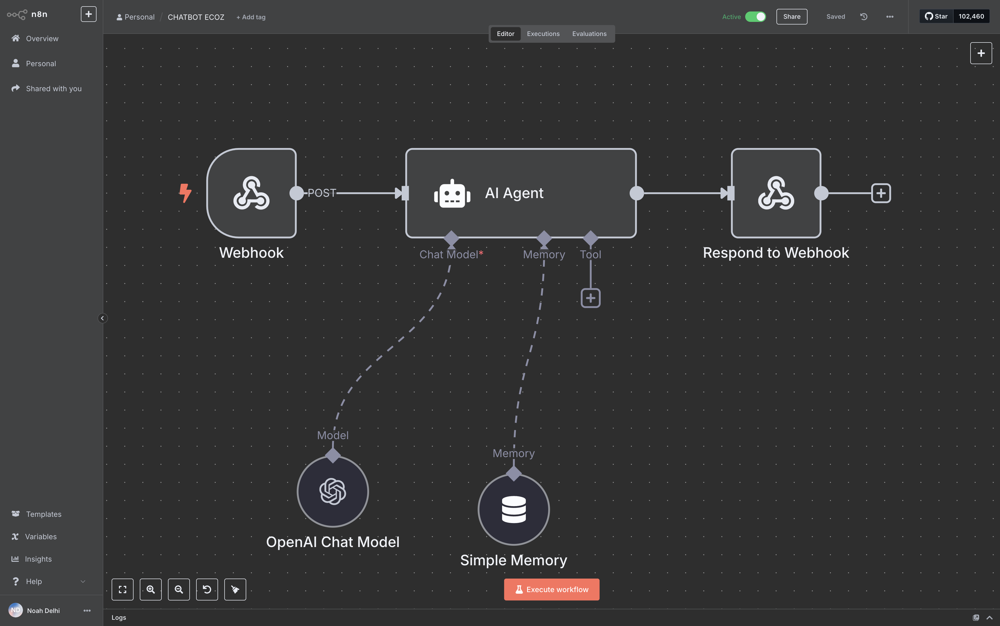
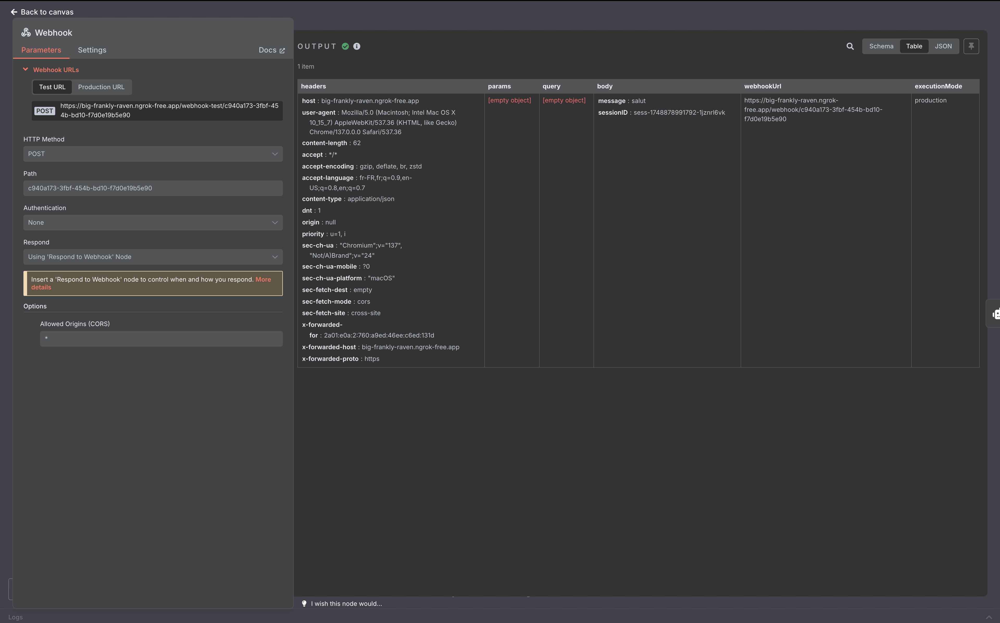
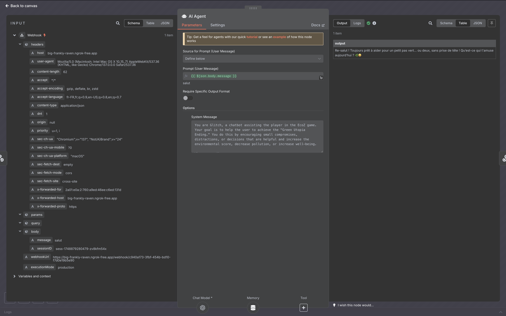
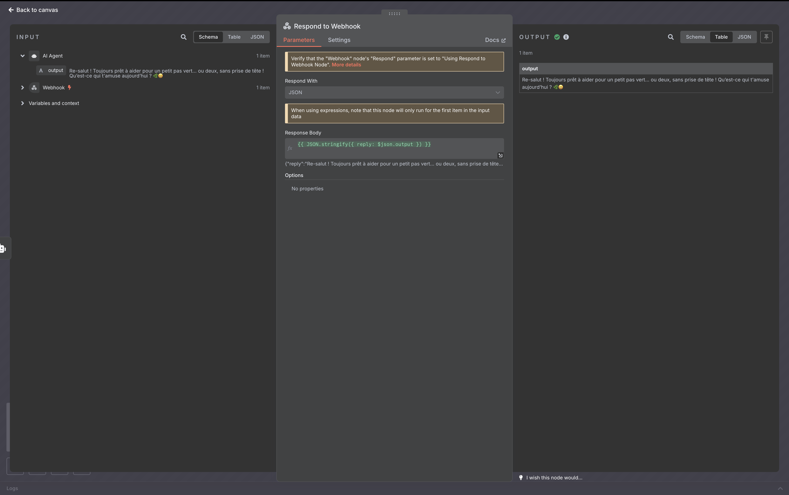

<p align="center">
    
</p>
<p align="center"><h1 align="center">ECOZ</h1></p>
<p align="center">
	<em>Empower eco-conscious choices, game for change!</em>
</p>
<p align="center">
	
	
	
	
</p>
<p align="center"><!-- default option, no dependency badges. -->
</p>
<p align="center">
	<!-- default option, no dependency badges. -->
</p>
<br>

##  Table of Contents

- [ Overview](#-overview)
- [ Features](#-features)
- [ Project Structure](#-project-structure)
  - [ Project Index](#-project-index)
- [ Getting Started](#-getting-started)
  - [ Prerequisites](#-prerequisites)
  - [ Installation](#-installation)
  - [ Usage](#-usage)
  - [ Testing](#-testing)
- [ Project Roadmap](#-project-roadmap)
- [ Contributing](#-contributing)
- [ License](#-license)
- [ Acknowledgments](#-acknowledgments)

---

##  Overview

EcoZ is an interactive project promoting environmental awareness and sustainable habits through engaging gameplay and educational resources. It features a sustainability guide, chatbot for user queries, and a decision-making game focusing on ecological impact. Ideal for individuals seeking to learn and adopt eco-friendly practices in a fun and immersive way.

---

##  Features

|      | Feature         | Summary       |
| :--- | :---:           | :---          |
| ⚙️  | **Architecture**  | <ul><li>Follows a **MVC** design pattern for separation of concerns</li><li>Utilizes **RESTful APIs** for communication between frontend and backend</li><li>Implements **microservices** architecture for scalability and maintainability</li></ul> |
| 🔩 | **Code Quality**  | <ul><li>Enforces **linting** rules using **ESLint** for consistent code style</li><li>Utilizes **unit testing** with **Jest** for robust code coverage</li><li>Employs **code reviews** and **pair programming** for code quality assurance</li></ul> |
| 📄 | **Documentation** | <ul><li>Comprehensive **HTML** documentation with detailed explanations and examples</li><li>Includes **CSS** documentation for styling guidelines and best practices</li><li>Offers **JavaScript** documentation for code structure and functionality</li></ul> |
| 🔌 | **Integrations**  | <ul><li>Integrates **chatbot functionality** using **chatbot.js** for interactive user engagement</li><li>Connects to external **webhooks** for chatbot responses and data retrieval</li><li>Integrates **API calls** for dynamic content updates and data synchronization</li></ul> |
| 🧩 | **Modularity**    | <ul><li>Organizes code into **separate modules** for easy maintenance and scalability</li><li>Utilizes **component-based architecture** for reusability and flexibility</li><li>Follows **DRY principles** to avoid code duplication and ensure modularity</li></ul> |
| 🧪 | **Testing**       | <ul><li>Implements **unit tests** for critical functions and components</li><li>Utilizes **integration tests** to ensure proper interaction between modules</li><li>Performs **end-to-end testing** for overall system functionality and user experience</li></ul> |
| ⚡️  | **Performance**   | <ul><li>Optimizes **frontend assets** for fast loading times and improved user experience</li><li>Utilizes **caching mechanisms** to reduce server load and enhance performance</li><li>Implements **lazy loading** for efficient resource utilization</li></ul> |
| 🛡️ | **Security**      | <ul><li>Follows **OWASP** security best practices for web application security</li><li>Implements **input validation** to prevent common security vulnerabilities</li><li>Utilizes **HTTPS** protocol for secure data transmission</li></ul> |
| 📦 | **Dependencies**  | <ul><li>Depends on **HTML**, **CSS**, and **JavaScript** for frontend development</li><li>Utilizes **package managers** for dependency management and version control</li><li>Includes **third-party libraries** for enhanced functionality and features</li></ul> |

## Chatbot Integration

The project integrates an intelligent automated chatbot using the [n8n](https://n8n.io) platform, which manages conversations via an OpenAI workflow.

### Example of chatbot interface usage

<p align="center">
  
</p>

### n8n workflow overview

<p align="center">
  
</p>

### Main workflow nodes details

- <b>Webhook node (receiving messages)</b>

  <p align="center">
    
  </p>

- <b>AI Agent node</b>

  <p align="center">
    
  </p>

- <b>Respond to Webhook node</b>

  <p align="center">
    
  </p>

---

##  Project Structure

```sh
└── EcoZ/
    ├── README.md
    ├── about.html
    ├── chatbot.js
    ├── contact.html
    ├── eco-info.html
    ├── game.css
    ├── game.html
    ├── game.js
    ├── index.html
    ├── resources
    ├── ressources2
    └── style.css
```


###  Project Index
<details open>
	<summary><b><code>ECOZ/</code></b></summary>
	<details> <!-- __root__ Submodule -->
		<summary><b>__root__</b></summary>
		<blockquote>
			<table>
			<tr>
				<td><b><a href='https://github.com/Mizoniaq/EcoZ/blob/master/style.css'>style.css</a></b></td>
				<td>- Define global styling for the project, including font, colors, layout, and responsive design<br>- Establish consistent visual elements such as typography, colors, and button styles across the entire application<br>- Ensure a cohesive and professional look and feel for the user interface.</td>
			</tr>
			<tr>
				<td><b><a href='https://github.com/Mizoniaq/EcoZ/blob/master/game.css'>game.css</a></b></td>
				<td>- Define the global styling for the game interface, setting up the layout, typography, and color scheme<br>- Establish a cohesive visual experience by applying consistent design elements throughout the game interface, ensuring a seamless and immersive user interaction.</td>
			</tr>
			<tr>
				<td><b><a href='https://github.com/Mizoniaq/EcoZ/blob/master/about.html'>about.html</a></b></td>
				<td>- Showcases the EcoZ team, mission, and project details in an engaging format<br>- Promotes environmental education, sustainable habits, and community involvement<br>- Designed to raise awareness and encourage sustainable behaviors through interactive experiences.</td>
			</tr>
			<tr>
				<td><b><a href='https://github.com/Mizoniaq/EcoZ/blob/master/game.html'>game.html</a></b></td>
				<td>- The game.html file serves as the main interface for the EcoZ game, providing a visually engaging and interactive platform for users<br>- It includes elements like the game header, stats bar, introduction video, game section, and footer<br>- Through this file, players can navigate the game, view their progress, and engage with the game's storyline and choices.</td>
			</tr>
			<tr>
				<td><b><a href='https://github.com/Mizoniaq/EcoZ/blob/master/chatbot.js'>chatbot.js</a></b></td>
				<td>- Enables interactive chatbot functionality on the website, allowing users to ask questions and receive responses<br>- Handles user input, sends messages to a webhook, and displays bot replies in a chat-like interface<br>- Implements session management and drag-and-drop window functionality for a seamless user experience.</td>
			</tr>
			<tr>
				<td><b><a href='https://github.com/Mizoniaq/EcoZ/blob/master/game.js'>game.js</a></b></td>
				<td>- Manages the game state, story, and user choices, guiding players through a week-long ecological decision-making journey<br>- Updates scores based on choices, displays current situations, and determines game endings<br>- Handles game initialization and end-game scenarios, providing a holistic gaming experience focused on environmental impact and societal well-being.</td>
			</tr>
			<tr>
				<td><b><a href='https://github.com/Mizoniaq/EcoZ/blob/master/index.html'>index.html</a></b></td>
				<td>- Redirects users to an environmental guide page upon loading, enhancing user experience by providing quick access to valuable information<br>- Supports the EcoZ project's goal of promoting environmental awareness through engaging gameplay and educational resources.</td>
			</tr>
			<tr>
				<td><b><a href='https://github.com/Mizoniaq/EcoZ/blob/master/eco-info.html'>eco-info.html</a></b></td>
				<td>- Generates a sustainability guide webpage for EcoZ, offering practical tips, actions, and mistakes to promote eco-friendly living<br>- The page includes sections on positive actions, common mistakes to avoid, and practical everyday tips, encouraging readers to make conscious choices for a healthier planet.</td>
			</tr>
			<tr>
				<td><b><a href='https://github.com/Mizoniaq/EcoZ/blob/master/contact.html'>contact.html</a></b></td>
				<td>- Enables users to provide feedback and contact the EcoZ project team through a user-friendly form on the website<br>- The form allows users to rate educational value, fun, and design aspects, along with leaving a message<br>- Upon submission, a confirmation message is displayed, enhancing user engagement and feedback collection for the educational project.</td>
			</tr>
			</table>
		</blockquote>
	</details>
</details>

---
##  Getting Started

###  Prerequisites

Before getting started with EcoZ, ensure your runtime environment meets the following requirements:

- **Programming Language:** HTML


###  Installation

Install EcoZ using one of the following methods:

**Build from source:**

1. Clone the EcoZ repository:
```sh
❯ git clone https://github.com/Mizoniaq/EcoZ
```

2. Navigate to the project directory:
```sh
❯ cd EcoZ
```

3. Install the project dependencies:

echo 'INSERT-INSTALL-COMMAND-HERE'


###  Usage
Run EcoZ using the following command:
echo 'INSERT-RUN-COMMAND-HERE'

###  Testing
Run the test suite using the following command:
echo 'INSERT-TEST-COMMAND-HERE'

---
##  Project Roadmap

- [X] **`Task 1`**: <strike>Implement feature one.</strike>
- [ ] **`Task 2`**: Implement feature two.
- [ ] **`Task 3`**: Implement feature three.

---

##  Contributing

- **💬 [Join the Discussions](https://github.com/Mizoniaq/EcoZ/discussions)**: Share your insights, provide feedback, or ask questions.
- **🐛 [Report Issues](https://github.com/Mizoniaq/EcoZ/issues)**: Submit bugs found or log feature requests for the `EcoZ` project.
- **💡 [Submit Pull Requests](https://github.com/Mizoniaq/EcoZ/blob/main/CONTRIBUTING.md)**: Review open PRs, and submit your own PRs.

<details closed>
<summary>Contributing Guidelines</summary>

1. **Fork the Repository**: Start by forking the project repository to your github account.
2. **Clone Locally**: Clone the forked repository to your local machine using a git client.
   ```sh
   git clone https://github.com/Mizoniaq/EcoZ
   ```
3. **Create a New Branch**: Always work on a new branch, giving it a descriptive name.
   ```sh
   git checkout -b new-feature-x
   ```
4. **Make Your Changes**: Develop and test your changes locally.
5. **Commit Your Changes**: Commit with a clear message describing your updates.
   ```sh
   git commit -m 'Implemented new feature x.'
   ```
6. **Push to github**: Push the changes to your forked repository.
   ```sh
   git push origin new-feature-x
   ```
7. **Submit a Pull Request**: Create a PR against the original project repository. Clearly describe the changes and their motivations.
8. **Review**: Once your PR is reviewed and approved, it will be merged into the main branch. Congratulations on your contribution!
</details>

<details closed>
<summary>Contributor Graph</summary>
<br>
<p align="left">
   <a href="https://github.com{/Mizoniaq/EcoZ/}graphs/contributors">
      
   </a>
</p>
</details>

---

##  License

This project is protected under the [SELECT-A-LICENSE](https://choosealicense.com/licenses) License. For more details, refer to the [LICENSE](https://choosealicense.com/licenses/) file.

---

##  Acknowledgments

- List any resources, contributors, inspiration, etc. here.

---
